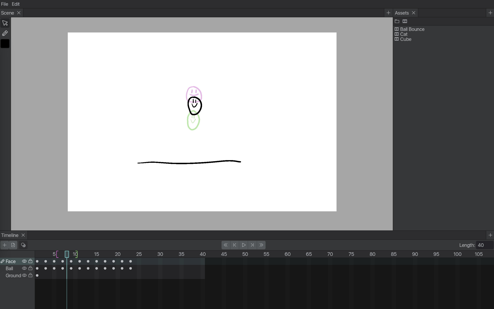

# Cipollino Studio

Cipollino Studio is a free, open-source 2D animation program for traditional animation. 

* [Features](#features)
* [Real-Time Collaboration](#realtime-collaboration)
* [Project Structure](#project-structure)
* [Namesake](#namesake)

## Features

Currently, Cipollino is still in early development, so it still lacks many essential features. In the future, Cipollino will have tools for every stage of the animation process, from storyboarding and rough animation to clean-up and compositing.

## Real-Time Collaboration

Cipollino's most unique feature is its optional real-time collaboration system, which allows multiple people to work on a single project at the same time. This will allow an entire team to work on an large animation project at once, syncing their work and using shared assets(e.g color palettes, sounds) without the organizational overhead of manually versioning work and sending files back and forth.

To allow for this, Cipollino has several features that make it possible to organize large projects. Animations can be split across multiple animation clips which animators can work on simultaneously, and assets can be organized neatly into folders with Cipollino's asset browser.

If you don't want to use the real-time collaboration, Cipollino also allows you to work locally, with projects stored on your computer like other animation programs.

## Project Structure 

This repo contains multiple Rust crates that Cipollino uses as dependencies. These crates are developed as independent libraries so that they can be used in other projects. Each library is named after a character from Soviet cinema. Here is a list of the libraries:

* `elic`: A utility library that includes types for math and computational geometry  
* `verter`: A file format designed to allow for efficient incremental updates 
* `alisa`: A framework for building apps with real-time collaboration
* `pierro`: An immediate-mode UI library
* `malvina`: A library for rendering vector art using WebGPU

For more information about each library, see their `README.md`s.

Cipollino itself is split into three crates:

* `cipollino-studio`: The app itself. Responsible for the editor UI and acts as a client for real-time collaboration. 
* `cipollino-server`: The real-time collaboration server for Cipollino.
* `project`: A library used by `cipollino-studio` and `cipollino-server` that defines the data structures that represent a Cipollino project and the operations used to modify it. Built on the `alisa` framework.

## Namesake

[Cipollino](https://en.wikipedia.org/wiki/Cipollino) is named after the protagonist of a [Soviet cartoon of the same name](https://www.youtube.com/watch?v=1vVlT8p9rnw). The cartoon is set in a kingdom inhabited by anthropomorphic vegetables ruled over by the tyrannical prince Lemon and signor Tomato. After Cipollino's father is unfairly imprisoned, he and his friends begin fighting against their kingdom's oppression and eventually overthrow prince Lemon. Cipollino is based on [Gianni Rodari's](https://en.wikipedia.org/wiki/Gianni_Rodari) 1951 novel *Il romanzo di Cipollino*.

Cipollino Studio's logo is traced from the Soviet animation.